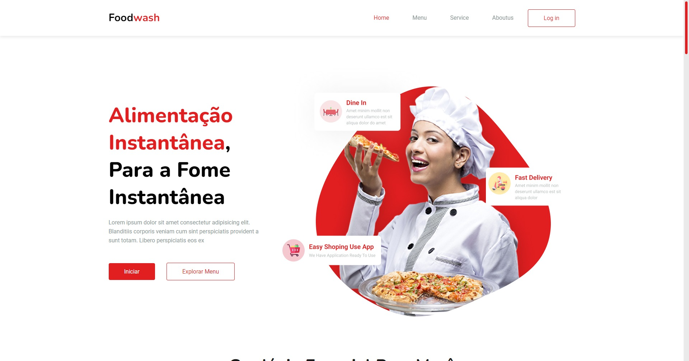
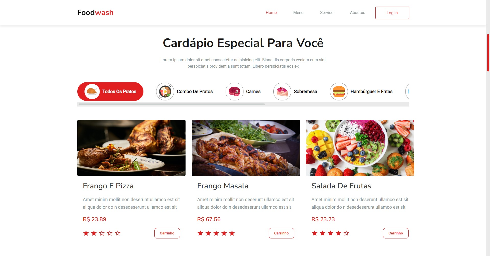
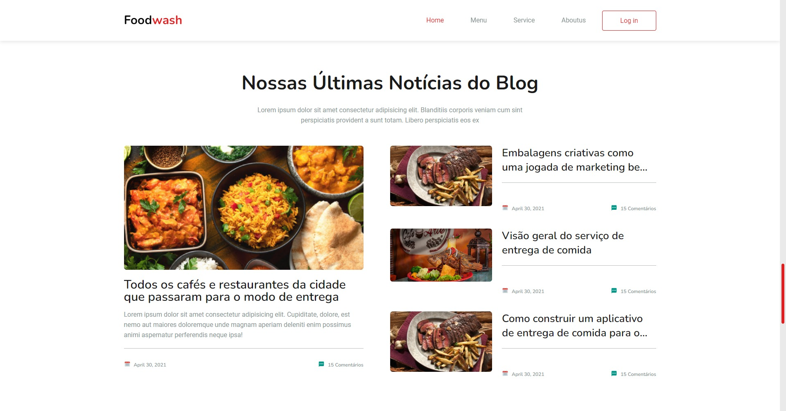

<h1 align="center">FoodWash</h1>

  

<!--  -->
</img>
</img> 
</img>
</img> 

 

## 💻 Projeto

O <b>FoodWash</b> e o web site de um atuante no ramo de entrega de comida pela internet, foi desenvolvido com base no design do [Asraful Islam](https://www.uplabs.com/posts/food-delivery-landing-page-design-3ae9eb6b-643b-4826-a674-1bbce27822b4)

## ✨ Tecnologias

Esse projeto foi desenvolvido com as seguintes tecnologias:
>Web
- [NodeJS](https://nodejs.org/en/)
- [TypeScript](https://www.typescriptlang.org/)
- [React](https://reactjs.org/)
- [React Router](https://v5.reactrouter.com/web/guides/quick-start)
- [Styled Components](https://styled-components.com/)
- [HTML](https://developer.mozilla.org/pt-BR/docs/Web/HTML)
> Api
- [NodeJS](https://nodejs.org/en/)
- [TypeScript](https://www.typescriptlang.org/)
- [Express](https://expressjs.com/)
- [Cors](https://github.com/expressjs/cors)

## 🚀 Como executar

- Clone o repositório
>APi
- Rode `cd Api` para ir até a pasta da api
- Rode `npm install` para instalar as dependências
- Rode o `npm run dev` para iniciar a aplicação na porta <b>3333</b>
- Por fim, a <b>API</b> estará disponível em `http://localhost:3333`
>Web
- Rode `cd web` para ir até a pasta web
- Rode `npm install` para instalar as dependências
- Rode o `npm run dev` para iniciar a aplicação na porta <b>3000</b>
- Por fim, o <b>Website</b> estará disponível em `http://localhost:3000`

## 📄 Licença

Esse projeto está sob a licença MIT. Veja o arquivo [LICENSE](LICENSE) para mais detalhes.
